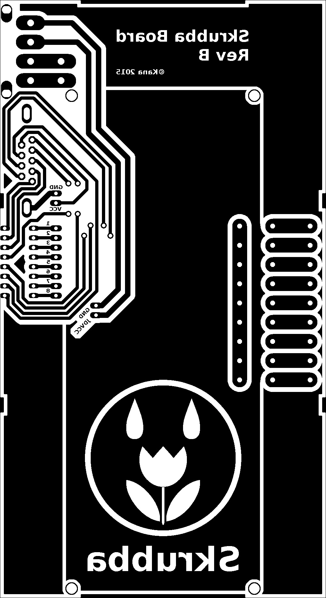

#Skrubba

Backend for Raspberry Pi based plant irrigation system

####INSTALLATION

prerequisites:

```
sudo apt-get update
sudo apt-get install python-pip
sudo apt-get install python-dev
sudo pip install flask
```

####HARDWARE:

- Raspberry Pi (A+ or similar)
- (din rail) 12V power supply
- Relay board with 8 relays
- step down regulator 5V
- female to female jumper wire
- 8x 12V solenoid valves
- RS-232 serial cable
- molex cable from computer power supply

####PCB



####WIRING: